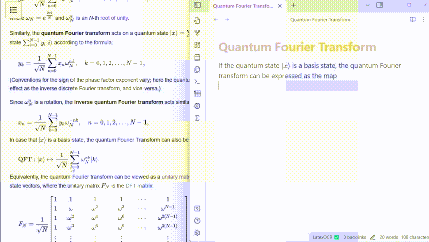
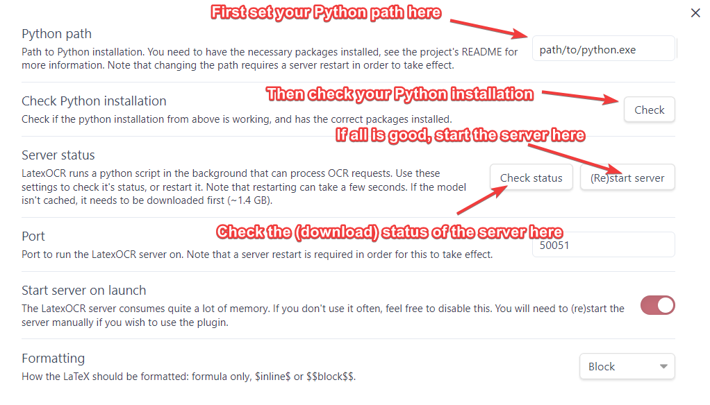

# Latex OCR for Obsidian

Generate Latex equations from images and screenshots inside your vault.



This plugin uses [NormXU's nougat-latex-ocr](https://github.com/NormXU/nougat-latex-ocr) model, which is based on PyTorch. Massive thanks to them for providing the open source model. Note that the plugin downloads the ~1.4 GB model and runs it locally. It also isn't perfect, and can get things wrong! Make sure to double check formulas.

Note this plugin is in ALPHA and currently more of a proof of concept. Please raise any issues you may find with the plugin using the issues tab on Github.

## Features

- Paste LaTeX equations directly into your notes using an image from your clipboard with a custom command (bind it to a hotkey like `Ctrl+Alt+v` if you use it often!).
- Transform images in your vault to LaTeX equations by choosing a new "Generate Latex" option in their context menu.

## Manual installation

This project uses a python package to do most of the heavy lifting. Install it using `pip` (or, preferably `pipx`):

```
pip install https://github.com/lucasvanmol/latex-ocr-server/releases/download/0.1.0/latex_ocr_server-0.1.0-py3-none-any.whl
```

You can check if it is installed by running

```
python -m latex_ocr_server --version
```


### Copy files

- Create a new folder for the plugin at `VaultFolder/.obsidian/plugins/obsidian-latex-ocr/`
- Navigate to this project's "Releases" tab
- Copy over `main.js`, `styles.css` and `manifest.json`, to your vault `VaultFolder/.obsidian/plugins/obsidian-latex-ocr/`.

### BRAT

You can also use [BRAT](https://github.com/TfTHacker/obsidian42-brat) to do this autmatically, and get automatic updates. Note that the `latex_ocr_server` python package is still required.

### GPU support

You can check if GPU support is working by running:

```
python -m latex_ocr_server info --gpu-available
```

If you want GPU support, follow the instructions at `https://pytorch.org/get-started/locally/` to install pytorch with CUDA. Note you may need to uninstall torch first. `torchvision` and `torchaudio` is not required. 

### Configuration

Open Obsidian and navigate to the Community Plugins section and enable the plugin. Then head to the LatexOCR settings tab to configure it.



You will first need to set the python path that the plugin will use to run the model in the LatexOCR settings. You can then check if it's working using the button below it. Once this is done, press "(Re)start Server".

Note that the first time you do this, the model needs to be downloaded from huggingface, and is around ~1.4 GB. You can check the status of this download in the LatexOCR settings tab by pressing "Check Status".

---

## Development

### How this plugin works

This plugin consists of two main parts. The first is [latex-ocr-server](https://github.com/lucasvanmol/latex-ocr-server), a python script that downloads and runs the model using huggingface transformers and pytorch. This script interfaces with the javascript plugin using protocol buffers, allowing the plugin to communicate and make requests to the python script.

The reason for this is that loading the model takes some time. This setup allows the model to be loaded in the background on startup, making subsequent requests much faster.

### Getting started

- Install NodeJS, then run `npm i` or `yarn` in the command line under the repo folder.
- Install the required python module from [latex-ocr-server](https://github.com/lucasvanmol/latex-ocr-server)
- Run `npm run dev` to compile the plugin from `main.ts` to `main.js`.
- Make changes to `main.ts` (or create new `.ts` files). Those changes should be automatically compiled into `main.js`.
- Reload Obsidian to load the new version of the plugin.
- Enable plugin in settings window.
- For updates to the Obsidian API run `npm update` in the command line under the repo folder.

### ESLint
- To use eslint with this project, make sure to install eslint from terminal:
  - `npm install -g eslint`
- To use eslint to analyze this project use this command:
  - `eslint main.ts`
  - eslint will then create a report with suggestions for code improvement by file and line number.
- If your source code is in a folder, such as `src`, you can use eslint with this command to analyze all files in that folder:
  - `eslint .\src\`

### Using protoc

```
python -m grpc_tools.protoc -I./protos --python_out=. --pyi_out=. --grpc_python_out=. ./protos/latex_ocr.proto
```

For js/ts, we use [ts-proto](https://github.com/stephenh/ts-proto)
```
protoc --plugin=protoc-gen-ts_proto=".\\node_modules\\.bin\\protoc-gen-ts_proto.cmd" --ts_proto_out=. ./protos/latex_ocr.proto --ts_proto_opt=outputServices=grpc-js
```

### API Documentation

See https://github.com/obsidianmd/obsidian-api

### Releasing new releases

- Update your `manifest.json` with your new version number, such as `1.0.1`, and the minimum Obsidian version required for your latest release.
- Update your `versions.json` file with `"new-plugin-version": "minimum-obsidian-version"` so older versions of Obsidian can download an older version of your plugin that's compatible.
- Tag and push, and let the releases workflow create the release
```
git tag -a 1.0.1 -m "1.0.1"
git push origin 1.0.1
```
- Publish the release.

> You can simplify the version bump process by running `npm version patch`, `npm version minor` or `npm version major` after updating `minAppVersion` manually in `manifest.json`.
> The command will bump version in `manifest.json` and `package.json`, and add the entry for the new version to `versions.json`

