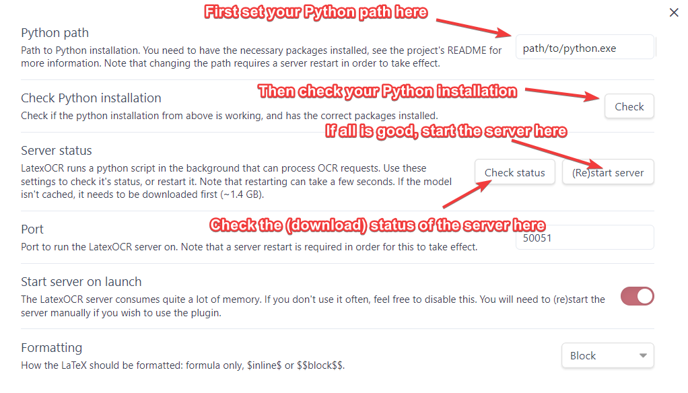

# Latex OCR for Obsidian
 

<a href="https://www.buymeacoffee.com/lucasvanmol" target="_blank"></a>

> ⚠️ **Inference API issues** ⚠️
> 
> The HuggingFace Inference API is not working as Hugging Face is currently **not supporting image-to-text models**. Check the [issue here](https://github.com/lucasvanmol/obsidian-latex-ocr/issues/37) for updates.
> Running locally is still supported & working and OpenAI's API is unaffected, so you can still use those options.


Generate Latex equations from images and screenshots inside your vault.


## Features

- Right click any image in your vault and choose "Generate LaTeX" to get the corresponding LaTeX code.
- Paste LaTeX equations directly into your notes using an image from your clipboard with a custom command (bind it to a hotkey like `Ctrl+Alt+V` if you use it often!).
- Transform images in your vault to LaTeX equations by choosing a new "Generate Latex" option in their context menu.
- Use either the HuggingFace [inference API](#using-huggingface-inference-api), using OpenAI [API](#using-openai-api), or [run locally](#run-locally)


## Using HuggingFace Inference API

By default, this plugin uses the HuggingFace inference API. Here's how you get your API key:
- Create an account or login at https://huggingface.co
- Create a `read` access token in your [Hugging Face profile settings](https://huggingface.co/settings/tokens). If you already have other access tokens I recommend creating one specifically for this plugin.
- After enabling the plugin in Obsidian, head to the Latex OCR settings tab, and input the API key you generated.

### Limitations
- The inference API is a free service by huggingface, and as such it requires some time to be provisioned. Subsequent requests should be a lot faster.
- If you would be interested in a low-cost subscription-based service that would get rid of this annoying waiting period, please react to [the related issue here](https://github.com/lucasvanmol/obsidian-latex-ocr/issues/13). I will consider building it if there is enough demand to pay for the server costs.

## Using OpenAI API
You can also use OpenAI's API to generate LaTeX code. This will require you to pay for usage: Typical costs are  ~$0.0001-0.0004 per image for simple equations. ~$0.001-0.003 per image for complex formulas. To use it, you need to:
- Create an account or login at https://platform.openai.com
- Create an new service key in the [API Keys section](https://platform.openai.com/account/api-keys) of your OpenAI account. Again, I recommend creating a key specifically for this plugin.
- Add funds to your OpenAI account. Sometimes OpenAI offers a free trial with some credits, but after that you will need to add a payment method and add funds to your account to continue using the API.
- After enabling the plugin in Obsidian, head to the Latex OCR settings tab, select "OpenAI API" as the provider, and input the API key you generated.

### Limitations
- OpenAI's API is a paid service, so you will need to add funds to your account to use it.
- Since we are using the general gpt-5 models it can be quite slow especially for large complex formulas.

## Run Locally

Alternatively, you can run the model locally. This requires installing an accompanying [python package](https://github.com/lucasvanmol/latex-ocr-server). Install it using `pip` (or, preferably `pipx`):

```
pip install latex-ocr-server
```

You can check if it is installed by running

```
python -m latex_ocr_server --version
```

### Configuration

Open Obsidian and navigate to the Community Plugins section and enable the plugin. Then head to the LatexOCR settings tab, enable "Use local model" and configure it.



You will first need to set the python path that the plugin will use to run the model in the LatexOCR settings. You can then check if it's working using the button below it. Once this is done, press "(Re)start Server".

Note that the first time you do this, the model needs to be downloaded from huggingface, and is around ~1.4 GB. You can check the status of this download in the LatexOCR settings tab by pressing "Check Status".

The status bar at the bottom will indicate the status of the server.

| Status     | Meaning            |
| ---------- | ------------------ |
| LatexOCR ✅ | server online      |
| LatexOCR ⚙️ | server loading     |
| LatexOCR 🌐 | downloading model  |
| LatexOCR ❌ | server unreachable |

If the server is online but you encounter an error getting a response from the server, ensure that the `Cache dir` filepath from the plugin settings is pointing to a valid folder and that the model has successfully been saved there. 

### GPU support

You can check if GPU support is working by running:

```
python -m latex_ocr_server info --gpu-available
```

If you want GPU support, follow the instructions at `https://pytorch.org/get-started/locally/` to install pytorch with CUDA. Note you may need to uninstall torch first. `torchvision` and `torchaudio` is not required. 


## Attribution

Massive thanks to [NormXU](https://github.com/NormXU/nougat-latex-ocr/) for training and releasing the model.
